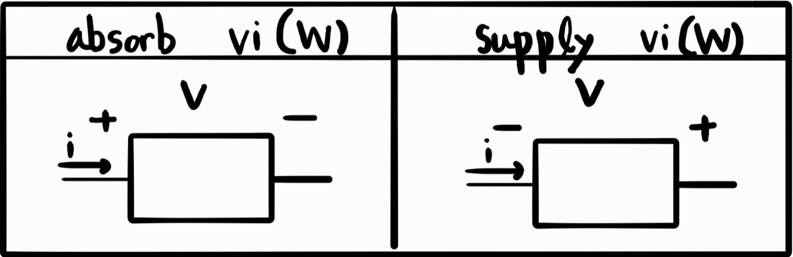
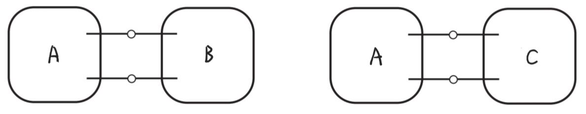
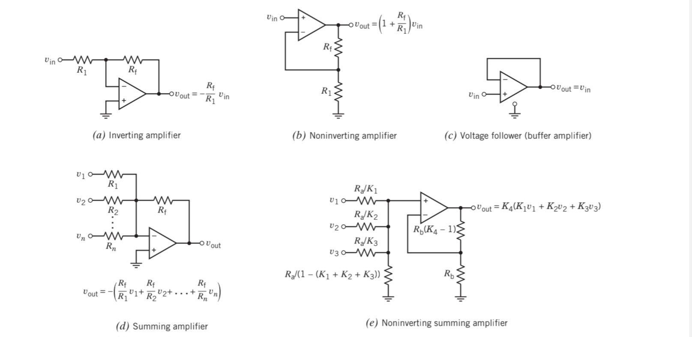
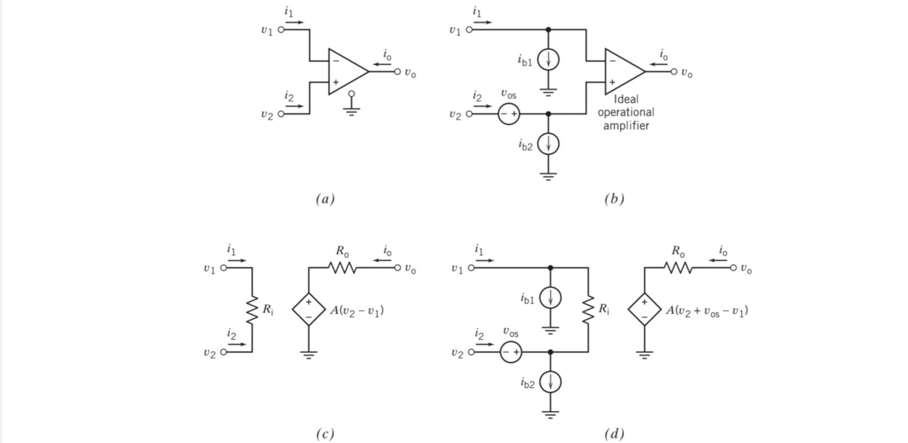

## Energy Absorption & Supply in Circuit Elements

Whether a circuit element **absorbs** or **supplies** energy depends on the **reference direction of voltage** with respect to the direction of current.

## Voltage Sign in Resistors

The voltage across a resistor depends on the reference direction of voltage and the direction of current.

Combining the energy absorption in circuit elements and voltage sign in resistors, we can conclude:

> 💡 **A resistor with positive resistance always absorbs energy, regardless of the reference directions of voltage and current.**

## Equivalent Circuit

If replacing a part of the circuit (B) with another circuit (C) does **not change** the voltage or current of any element in the remaining circuit (A),  
then **C is said to be the equivalent circuit of B**, and vice versa.

## Design Using Op-Amp

To design with operational amplifiers, it is helpful to **memorize common configurations** that relate input(s) to output based on the desired signal behavior.

## Practical Op-Amp

In real life, an op-amp is not ideal. Several **non-ideal models** can be considered depending on the required accuracy.

> 💡 Bias current, input offset voltage, voltage gain and internal resistances for a practical op-amp vary by model and can be referenced from standard datasheets or textbooks.
