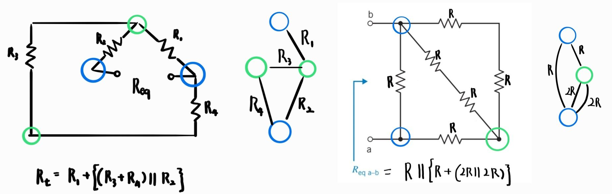
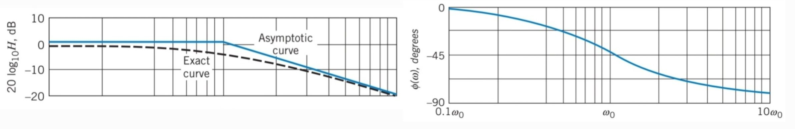

## Energy Absorption & Supply in Circuit Elements

Whether a circuit element **absorbs** or **supplies** energy depends on the **reference direction of voltage** with respect to the direction of current.

## Voltage Sign in Resistors

The voltage across a resistor depends on the reference direction of voltage and the direction of current.

Combining the energy absorption in circuit elements and voltage sign in resistors, we can conclude:

> 💡 **A resistor with positive resistance always absorbs energy, regardless of the reference directions of voltage and current.**

## Equivalent Circuit

If replacing a part of the circuit (B) with another circuit (C) does **not change** the voltage or current of any element in the remaining circuit (A),  
then **C is said to be the equivalent circuit of B**, and vice versa.

### 💡 Mapping Equivalent Resistance: Simplifying a Complex Resistor Network

1. **Mark all nodes** as distinct dots or circles  
2. **Draw resistors as lines** connecting these nodes

  
## Design Using Op-Amp

To design with operational amplifiers, it is helpful to **memorize common configurations** that relate input(s) to output based on the desired signal behavior.

## Practical Op-Amp

In real life, an op-amp is not ideal. Several **non-ideal models** can be considered depending on the required accuracy.

> 💡 Bias current, input offset voltage, voltage gain and internal resistances for a practical op-amp vary by model and can be referenced from standard datasheets or textbooks.

## Frequency Response

### Gain

The **gain** of a system refers to the **ratio of output to input amplitudes**:

- **Linear scale** (general):  
  `Gain = Output / Input`  
  Can be **negative** if the output is **180° out of phase** with the input.

- **Magnitude in Bode plot**:  
  - For **power**:  `Gain_dB = 10 * log10( |Output / Input| )`  
  - For **voltage or current**: `Gain_dB = 20 * log10( |Output / Input| )`  
  We use **magnitude only**, so we apply the absolute value.
  Phase inversion is handled separately in the **phase plot**.
  
### Bode Plot

A **Bode plot** displays the **gain (in dB)** and **phase (in degrees)** of a **network function** versus the **logarithm of frequency**.

The **exact magnitude Bode plot** is a smooth curve that accurately represents the frequency response (**drawn as a solid blue line**).  
The **asymptotic magnitude Bode plot** is a piecewise linear approximation (**drawn as a black dashed line**).

> 💡 **Definition-wise, the Bode plot is the exact magnitude and phase plot. But in most practical contexts, "sketching" the Bode plot refers to drawing the asymptotic approximation.**

### Corner Frequency vs. Break Frequency

- **Corner frequency**:  
  The frequency at which the gain drops to  
  `1/√2 × maximum gain`  
  It often occurs when ω → 0 or ω → ∞ gives the maximum gain.

- **Break frequency**:  
  The frequency at which the **asymptotic magnitude Bode plot** changes slope.

> 💡 In simple systems, these frequencies are often the same, but they are conceptually different.
