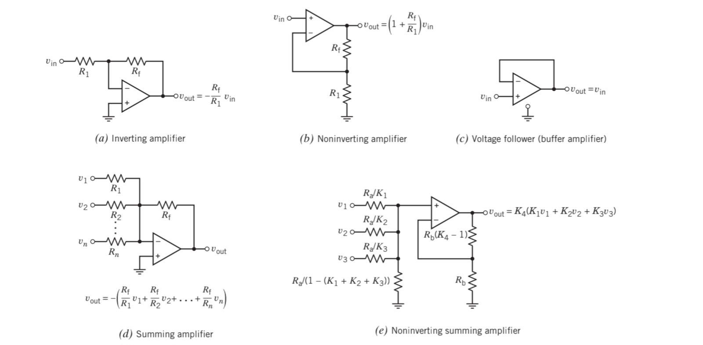

## Energy Absorption & Supply in Circuit Elements

Whether a circuit element **absorbs** or **supplies** energy depends on the **reference direction of voltage** with respect to the direction of current.

## Voltage Sign in Resistors

The voltage across a resistor depends on the reference direction of voltage and the direction of current.

Combining the energy absorption in circuit elements and voltage sign in resistors, we can conclude:

> 💡 **A resistor with positive resistance always absorbs energy, regardless of the reference directions of voltage and current.**

## Equivalent Circuit

If replacing a part of the circuit B with another circuit C does **not change** the voltage or current of any element in the remaining circuit A, then **C is said to be the equivalent circuit of B**, and vice versa. 

> 💡 **Why do we use equivalent circuits?**
> We are interested in the voltage or current in circuit A, not in B or C (since those will generally change).
>  To simplify the analysis, we replace the rest of the circuit with an equivalent circuit suited to our purpose.

 

### Mapping Equivalent Resistance: Simplifying a Complex Resistor Network 
1. **Mark all nodes** as distinct dots or circles 
2. **Draw resistors as lines** connecting these nodes 

 

### Thevenin & Norton Equivalent
Among the infinitely many possible equivalent circuits, the Thevenin and Norton forms are particular choices that have proven especially useful.

## Analyzing Circuits with KCL & KVL — Quick Tips
1. Identify the **target** (current or voltage).  
2. Apply all given relations before using supernode/supermesh.  
3. **KCL**: Keep a consistent direction — incoming currents on the left, outgoing on the right.  
4. **KVL**: List resistances, add voltage sources with correct signs, then write current terms.  
5. **Notation**: Node voltages in ○, currents (entry side) in □.

## Operational Amplifier
  
### Design Using Op-Amp

To design with operational amplifiers, it is helpful to **memorize common configurations** that relate input(s) to output based on the desired signal behavior.

### Practical Op-Amp

In real life, an op-amp is not ideal. Several **non-ideal models** can be considered depending on the required accuracy.

> 💡 Bias current, input offset voltage, voltage gain and internal resistances for a practical op-amp vary by model and can be referenced from standard datasheets or textbooks.

### Capacitor: Charge–Voltage Relationship

The amount of **charge** stored in a capacitor is proportional to the voltage across its plates:
q=Cv

## Frequency Response

### Gain in Frequency Response

The **gain** of a system in frequency response refers to the **ratio of output to input amplitudes**: 

- **Linear scale**:  
  Gain = Output amplitude / Input amplitude  
  This value is always **positive**, since amplitudes represent magnitudes and are inherently non-negative.

- **dB scale**:  
  - For **power**:  Gain_dB = 10 * log10(Gain)  
  - For **voltage or current**: Gain_dB = 20 * log10(Gain)
  
### Bode Plot

A **Bode plot** displays the **gain (in dB)** and **phase (in degrees)** of a **network function** versus the **logarithm of frequency**.

The **exact magnitude Bode plot** is a smooth curve that accurately represents the frequency response (**drawn as a solid blue line**).  
The **asymptotic magnitude Bode plot** is a piecewise linear approximation (**drawn as a black dashed line**).

> 💡 **Definition-wise, the Bode plot is the exact magnitude and phase plot. But in most practical contexts, "sketching" the Bode plot refers to drawing the asymptotic approximation.**

### 3dB Frequency vs. Corner Frequency

- **3dB frequency=cutoff frequency**:  
  The frequency at which the gain drops to  
  `1/√2 × maximum gain`  
  It often occurs when ω → 0 or ω → ∞ gives the maximum gain.

- **Corner frequency, Break frequency**:  
  The frequency at which the **asymptotic magnitude Bode plot** changes slope.

> 💡 In first-order systems, the 3dB and corner frequencies are identical. In higher-order systems, they may differ—unless the poles are widely separated, in which case the corner frequency remains a good approximation.
